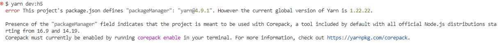

# 前端开发文档（uni-app + Vue3 + TS）V1.0

项目：打旋牌线上对局平台

## 0. 技术栈与约定

### 0.1 技术栈

- 框架：uni-app（Vue3 模式）
- 语言：TypeScript
- 状态管理：Pinia
- 网络：uni.request + 封装层
- 实时通信：uni.connectSocket（WebSocket）
- UI：uni-ui / 自研组件（建议自研房间与牌桌核心组件）

### 0.2 代码规范/约定

- TS 严格模式开启（`"strict": true`）。
- 所有接口响应统一走 `ApiResponse<T>` 类型。
- store 只做**状态与纯函数派生**，不做 DOM 逻辑。
- 对局逻辑**服务端权威**：
  - 前端只呈现 `state`
  - 按 `allowedActions` 渲染按钮
  - 不做任何结算/合法性判断

------

## 1. 工程结构与路由

### 1.1 目录结构

```
src/
  pages/
    login/              # 短信登录
    hall/               # 匹配大厅
    match/              # 匹配排队页
    table/              # 牌桌对局页（WS）
    replay/             # 复盘页
    profile/            # 个人信息
    records/            # 对局记录列表
    agent/              # 代理面板
  components/
    common/
      AppHeader.vue
      AvatarAnon.vue
      Countdown.vue
      ModalConfirm.vue
    hall/
      SceneCard.vue
      BalanceBar.vue
    table/
      SeatList.vue
      SeatItem.vue
      ActionBar.vue
      BetPanel.vue
      CardsHand.vue
      RoundIndicator.vue
      LogTicker.vue
  store/
    user.ts
    wallet.ts
    hall.ts
    match.ts
    table.ts
    replay.ts
    agent.ts
  services/
    http.ts
    user.api.ts
    wallet.api.ts
    hall.api.ts
    match.api.ts
    game.ws.ts
    replay.api.ts
    agent.api.ts
  types/
    api.ts
    user.ts
    wallet.ts
    hall.ts
    match.ts
    game.ts
    replay.ts
    agent.ts
  utils/
    crypto.ts
    geo.ts
    debounce.ts
    storage.ts
    logger.ts
  static/
  App.vue
  main.ts
  pages.json
  manifest.json
```

### 1.2 pages.json 路由（示例）

```
{
  "pages": [
    { "path": "pages/login/index", "style": { "navigationBarTitleText": "登录" }},
    { "path": "pages/hall/index", "style": { "navigationBarTitleText": "大厅" }},
    { "path": "pages/match/index", "style": { "navigationBarTitleText": "匹配中" }},
    { "path": "pages/table/index", "style": { "navigationBarTitleText": "牌桌" }},
    { "path": "pages/replay/index", "style": { "navigationBarTitleText": "复盘" }},
    { "path": "pages/records/index", "style": { "navigationBarTitleText": "对局记录" }},
    { "path": "pages/profile/index", "style": { "navigationBarTitleText": "个人信息" }},
    { "path": "pages/agent/index", "style": { "navigationBarTitleText": "代理中心" }}
  ]
}
```

### 1.3 路由守卫（App.vue / main.ts）

- 未登录 → 强制跳转登录
- 被封禁 → 展示封禁弹窗并禁止进入对局页
- 进入 table/replay 页必须带 match/tableId 参数

------

## 2. 网络层与类型体系

### 2.1 统一响应类型

```
export interface ApiResponse<T> {
  code: number;      // 0=ok
  msg: string;
  data: T;
  traceId?: string;
}
```

### 2.2 http.ts 封装要点

- 自动注入 token
- 自动刷新 token（若后端支持 refresh）
- 错误统一 toast
- 支持请求取消（匹配轮询用）

```
const BASE_URL = import.meta.env.VITE_API_BASE;

export async function request<T>(
  options: UniApp.RequestOptions
): Promise<T> {
  const token = userStore().token;
  return new Promise((resolve, reject) => {
    uni.request({
      url: BASE_URL + options.url,
      method: options.method ?? 'GET',
      data: options.data,
      header: {
        ...options.header,
        Authorization: token ? `Bearer ${token}` : ''
      },
      success(res) {
        const r = res.data as ApiResponse<T>;
        if (r.code === 0) resolve(r.data);
        else {
          uni.showToast({ title: r.msg, icon: 'none' });
          reject(r);
        }
      },
      fail(err) {
        uni.showToast({ title: '网络异常', icon: 'none' });
        reject(err);
      }
    });
  });
}
```

### 2.3 API 文件按域拆分

- `user.api.ts`（短信登录、资料）
- `wallet.api.ts`（余额、充值）
- `hall.api.ts`（场次列表）
- `match.api.ts`（join/cancel/status）
- `replay.api.ts`（记录/复盘）
- `agent.api.ts`（代理面板）

------

## 3. 状态管理（Pinia）

### 3.1 userStore

```
export const useUserStore = defineStore('user', {
  state: () => ({
    token: '',
    profile: null as UserProfile | null,
    banned: false
  }),
  actions: {
    setToken(t: string) { this.token = t; storage.set('token', t); },
    async loadProfile() { this.profile = await userApi.getProfile(); }
  }
});
```

### 3.2 walletStore

- 进入大厅、对局结算后刷新
- 对局中余额仅展示 `tableState.myChips`

### 3.3 matchStore

- 保存 `queueId / status / tableId / sceneId`
- 轮询 `match/status` 或 SSE（V1.1）
- 匹配成功自动跳 table

### 3.4 tableStore（最关键）

- 只存**服务端 state 镜像**
- 任何 UI 都从 state 派生
- 不存“本地推断”的回合逻辑

```
export interface TableState {
  round: 1|2|3;
  turnSeat: number;
  lastRaise: number;
  mangoStreak: number;
  countdown: number;
  allowedActions: ActionType[];
  seats: SeatDTO[];
  myCards: string[]; // "**" or real
  logs: LogItem[];
}

export const useTableStore = defineStore('table', {
  state: () => ({
    tableId: '',
    wsConnected: false,
    state: null as TableState | null
  }),
  actions: {
    applyState(s: TableState) { this.state = s; }
  }
});
```

------

## 4. WebSocket 实时对局实现

### 4.1 连接生命周期

**进入牌桌页时：**

1. `connect(tableId)`
2. `onOpen` → `rejoin`（带 token）
3. `onMessage` → 分发
4. `onClose` → 标记断线，走重连
5. 离开页面 `onUnload` → `close()`

### 4.2 game.ws.ts（核心封装）

```
class GameWS {
  private socketTask?: UniApp.SocketTask;
  private hbTimer?: number;
  private reconnectTimer?: number;
  private retry = 0;

  connect(tableId: string) {
    const url = `${WS_BASE}/ws/table/${tableId}?token=${useUserStore().token}`;
    this.socketTask = uni.connectSocket({ url });

    this.socketTask.onOpen(() => {
      useTableStore().wsConnected = true;
      this.retry = 0;
      this.startHeartbeat();
      this.send({ type: 'rejoin', data: {} });
    });

    this.socketTask.onMessage((evt) => {
      const msg = JSON.parse(evt.data as string) as WSMessage;
      this.handleMsg(msg);
    });

    this.socketTask.onClose(() => this.reconnect(tableId));
    this.socketTask.onError(() => this.reconnect(tableId));
  }

  send(payload: WSAction) {
    this.socketTask?.send({ data: JSON.stringify(payload) });
  }

  private startHeartbeat() {
    this.hbTimer && clearInterval(this.hbTimer);
    this.hbTimer = setInterval(() => {
      this.send({ type: 'ping', data: {} });
    }, 10000) as unknown as number;
  }

  private reconnect(tableId: string) {
    useTableStore().wsConnected = false;
    this.hbTimer && clearInterval(this.hbTimer);
    if (this.retry >= 5) return;
    const delay = Math.min(1000 * 2 ** this.retry, 8000);
    this.retry++;
    this.reconnectTimer && clearTimeout(this.reconnectTimer);
    this.reconnectTimer = setTimeout(() => this.connect(tableId), delay) as unknown as number;
  }

  private handleMsg(msg: WSMessage) {
    if (msg.type === 'state') useTableStore().applyState(msg.data);
    if (msg.type === 'error') uni.showToast({ title: msg.data.message, icon: 'none' });
    if (msg.type === 'pong') return;
  }

  close() {
    this.hbTimer && clearInterval(this.hbTimer);
    this.socketTask?.close({});
  }
}

export const gameWS = new GameWS();
```

### 4.3 WS 消息类型（types/game.ts）

```
export type ActionType =
  | 'pass' | 'call' | 'raise' | 'knock_bobo'
  | 'fold' | 'ready' | 'rejoin' | 'ping';

export interface WSMessage {
  type: 'state' | 'error' | 'pong' | 'log';
  seq: number;
  data: any;
}

export interface WSAction {
  type: ActionType;
  data: any;
}
```

------

## 5. 牌桌 UI 关键实现

### 5.1 牌桌页状态驱动（pages/table/index.vue）

- `state` 为空 → loading
- `round` 变化 → 切换 UI 区域
- `allowedActions` 控制 ActionBar 按钮
- `countdown` 进入倒计时组件

```
<ActionBar
  :allowed="state.allowedActions"
  :lastRaise="state.lastRaise"
  @pass="onPass"
  @call="onCall"
  @raise="onRaise"
  @knock="onKnock"
/>
```

### 5.2 ActionBar 逻辑（禁止本地推断）

- 如果 `allowed` 不含某动作 → 按钮 disabled
- raise 输入框最小值由 `lastRaise` 决定（服务端也会校验）

```
const can = (a: ActionType) => props.allowed.includes(a);
```

### 5.3 第二圈“拖动=敲波波”

- 前端只做手势采集
- 手势触发 → 发 `knock_bobo`
- 服务端 state 回来后显示“已敲”

### 5.4 第三圈“不能发照直接比牌”

- round==3 时：
  - 隐藏发照按钮/手势区
  - 展示“比牌中/摊牌动画”组件
- 摊牌动画可基于 `state.result` 做

------

## 6. 匹配与定位实现

### 6.1 定位采集

在大厅进入或点击匹配前执行：

```
uni.getLocation({
  type: 'wgs84',
  success(res) {
    hallStore().setGPS(res.latitude, res.longitude);
  },
  fail() {
    hallStore().setGPS(null, null);
  }
});
```

### 6.2 匹配 join

- 上传 `sceneId + gps + ip(可后端获取)`
- 成功返回 queueId
- 跳转 match 页

### 6.3 match 页轮询

```
let timer: number;

onMounted(() => {
  timer = setInterval(async () => {
    const st = await matchApi.status();
    matchStore().update(st);
    if (st.status === 'matched') {
      clearInterval(timer);
      uni.redirectTo({ url: `/pages/table/index?tableId=${st.tableId}` });
    }
  }, 1500) as unknown as number;
});

onUnmounted(() => clearInterval(timer));
```

------

## 7. 复盘与记录实现

### 7.1 记录列表

- 分页加载（上拉触底）
- 卡片展示：时间/场次/净输赢/mangoStreak/抽成
- 点击进入 replay

### 7.2 复盘时间线渲染

- 后端给 timeline JSON
- 前端按 round → actions → 动画回放
- 只显示匿名玩家标签 A/B/C
- 支持 1x/2x 速度、拖动进度条（本地实现）

------

## 8. 代理面板实现

- dashboard API 返回：
  - inviteCode
  - totalInvited / activeInvited
  - totalProfit / todayProfit
  - levelList（L1/L2...）
- 分润明细分页列表

------

## 9. 性能与稳定性

### 9.1 WS 消息节流

- 服务端可能 1 秒多次 state
- 前端渲染层做 `requestAnimationFrame` 合并：

```
let pending: TableState|null = null;
let rafId = 0;

function onState(s: TableState) {
  pending = s;
  if (!rafId) {
    rafId = requestAnimationFrame(() => {
      tableStore().applyState(pending!);
      pending = null;
      rafId = 0;
    });
  }
}
```

### 9.2 图片/动画优化

- 头像、背景图全部本地静态或 CDN
- 动画避免大面积重排（用 transform/opacity）

### 9.3 弱网与重连

- `wsConnected=false` 显著提示
- 重连成功后依赖服务端 `rejoin` 发全量 state

------

## 10. 安全与隐私（前端侧）

1. **不存对手信息**：
   - seats 只存 alias/seat/chips/status
2. **敏感 UI 不落地**：
   - 不在本地记录对手牌面
3. token：
   - `storage.set('token')`
   - app 退到后台可考虑 30 分钟无操作重新登录（可选）

# uniapp

#### 介绍

uniapp vue3 ts vite pinia axios router-next wot design

### 安装运行

```
yarn
yarn dev (小程序环境)
yarn dev:h5
...
具体查看package.json
```

### mock

项目可以使用 mock 接口，在 mock 文件夹下，接口前缀必须是 mock

### 分包

在 pages.json 中， 与 pages 同级添加
"subPackages": [
{
"root": "subPages",
"pages": [
]
}
],

#### 启动时

如果启动时报错

两种方案：

- 将 yarn 升级至 4.9.1 版本(需开启 core,嫌麻烦可看第二步)
- 将 package.json 页面中的最底部

```
"packageManager": "yarn@4.9.1+sha512.f95ce356460e05be48d66401c1ae64ef84d163dd689964962c6888a9810865e39097a5e9de748876c2e0bf89b232d583c33982773e9903ae7a76257270986538"
这一行删除, 重新执行yarn
```

### 模拟请求

- 请求时可以实现 mock 方式请求，但是需要将接口前缀写为 mock。 如：

```typescript
api.ts
// mock 请求示例
export function fetchMockTest() {
	return request<IHttpResponse>({
		url: `/mock/getMockData`,
		method: "GET",
	});
}

index.vue
import { fetchMockTest } from "./api.ts";
const handleRequest = () => {
	fetchMockTest().then((res) => {
		console.log(res);
	});
};
注： mock请求只在小程序下有效，h5无效!!
```

### css 使用

可在 scr/static/css/base.scss 、 scr/static/css.index.scss 查看公共样式


### components
+ navbar
```vue
<template>
<Navbar :title="title" :theme="navBarOpacity >= 1 ? 'dark' : 'light'"
            :background="`rgba(255, 255, 255, ${navBarOpacity})`" />
<Navbar :title="title" :theme="navBarOpacity >= 1 ? 'dark' : 'light'"
            :background="`rgba(255, 255, 255, ${navBarOpacity})`" placeholder/>
</template>
<script>
import { onPageScroll } from "@dcloudio/uni-app";
import Navbar from "@/components/navbar/navbar.vue";

const navBarOpacity = ref(0)
const placeholder = ref(true); // placeholder = true, 顶部导航栏会占顶部高度，和navbar平级的元素会正常显示在navbar下方
onPageScroll((e) => {
	navBarOpacity.value = e.scrollTop / 50;
});
</script>
```